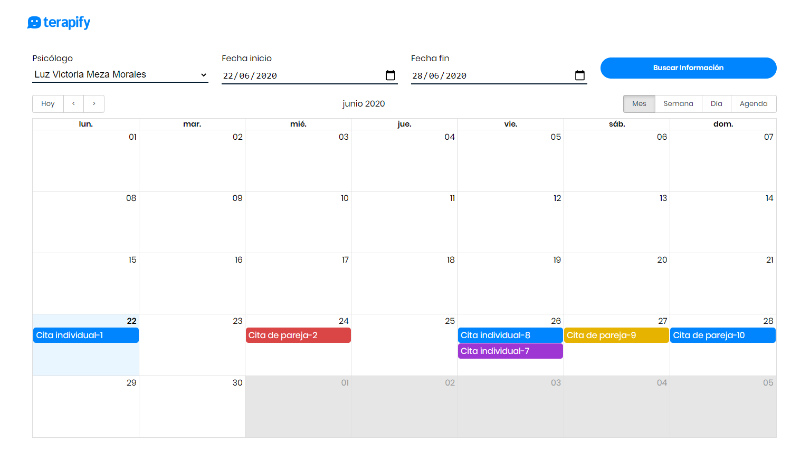
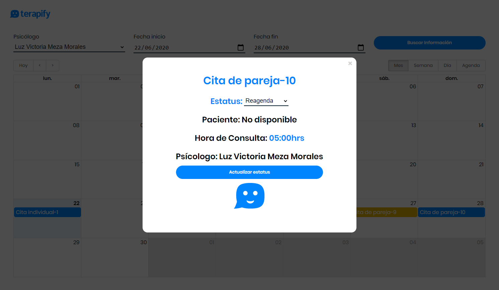
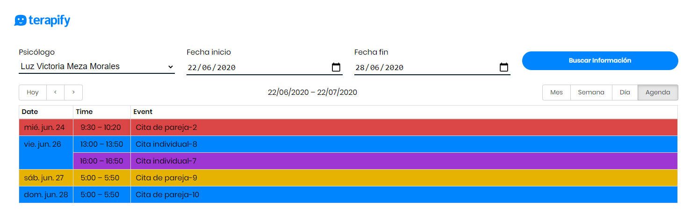

# Terapify Calendar - Calendar of Appointments

Calendar to see psychologist appointments, developed with ReactJs and using terapify-api.


### 🚀 Links

 * **Live Demo:** https://williamvelazquez.github.io/terapify-calendar/


### 🛠️ Installation

Require Node.JS
```
npm install
```

Create a **.env** file at root level following the example file (.env-example).
```
PORT=3001
NODE_ENV=development
```

### 🖥 Execution

📌**Development Environment**
```
npm run dev
```

>This project runs on **http://localhost:3001** or the specified **PORT** on the .env file.

📌**Production Environment**

Run the following command to create the production build over the **dist** folder:
```
npm run prod
```

>After creating the production build you can open the **index.html** on your browser.

📌**Testing with Interface**
```
npm run dev
```
>This project runs on **http://localhost:3001** or the specified **PORT** on the .env file.

>You must specify the same port at the **/test/cypress.json** file.

After running the project, on other terminal run:
```
npm run test
```
After a moment a cypress window will appear, to run the test click on: **cashOpening.spec.js**

📌**Testing from terminal**
```
npm run dev
```
>This project runs on **http://localhost:3001** or the specified **PORT** on the .env file.

>You must specify the same port at the **/test/cypress.json** file.

After running the project, on other terminal run:
```
npm run test:run
```

📌**Deployment on GitHub Pages**

Run the following command to create the production build and deploy on gh-pages branch for the first time:
```
npm run deploy:new
```

Run the following command to create the production build and deploy if you already have the gh-pages branch:
```
npm run deploy
```


### 💻 Technologies

  * React
  * ESLint
  * Webpack


## 📦Backend Information

[**Terapify API - Backend Repository**](https://github.com/WilliamVelazquez/terapify-api)

You can test the [**Backend**](https://terapify-api.vercel.app/api/appointments) on the following URL https://terapify-api.vercel.app/api/appointments


### ✒️ Author

* **William Velazquez** - [WilliamVelazquez](https://williamvelazquez.com/)

If you want to know about the insights [click here!](https://github.com/WilliamVelazquez/terapify-calendar/pulse/monthly)


### 📷 Screenshots





## 📄License

This project is licensed under the terms of the **MIT license**.


### 🎁 Contribute

Feel free to contribute to the project!
